# FinanceGPT Pro - MCP Architecture Flow

## System Architecture Overview

## Detailed MCP Flow

```mermaid
sequenceDiagram
    participant User
    participant Frontend
    participant Backend
    participant IntentDetector
    participant MCPTools
    participant GeminiAI

    User->>Frontend: Ask financial question<br/>"Help me budget $5000"
    Frontend->>Backend: Send message via API
    Backend->>IntentDetector: Analyze message intent
    IntentDetector-->>Backend: Detected: "budget"

    Backend->>MCPTools: Execute budget_analyzer
    MCPTools-->>Backend: Return calculations

    Backend->>GeminiAI: Get AI insights
    GeminiAI-->>Backend: Enhanced response

    Backend-->>Frontend: Stream response +<br/>MCP tools metadata
    Frontend-->>User: Display answer with<br/>🔧 MCP Tools badges
```

## MCP Tools Categories

## Key Features

### 1. **Intent Detection**
- Automatically identifies user's financial needs
- Maps questions to appropriate MCP tools
- No manual tool selection needed

### 2. **MCP Tool Execution**
- 20+ specialized financial calculators
- Real-time computation
- Accurate financial modeling

### 3. **AI Enhancement**
- Gemini AI provides context
- Personalized explanations
- Actionable insights

### 4. **Visual Feedback**
- Purple badges show tools used
- Transparent process
- Build user trust

## Example Flow

**User asks:** "I want to save $10,000 in 2 years"

1. **Intent Detection** → Identifies "savings" intent
2. **MCP Tool** → Executes `savings_calculator`
3. **Calculation** → Monthly savings: $417
4. **AI Enhancement** → Suggests budget adjustments
5. **Display** → Shows answer with 🔧 Savings Calculator badge

## Benefits for Users

- **Transparent**: See which tools are being used
- **Accurate**: Professional financial calculations
- **Intelligent**: AI-enhanced recommendations
- **Fast**: Real-time tool execution
- **Comprehensive**: 20+ financial tools in one platform