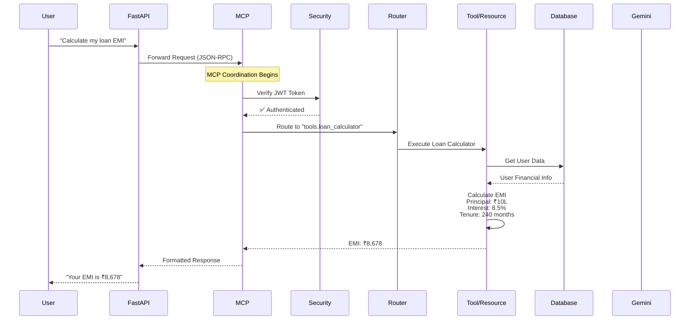
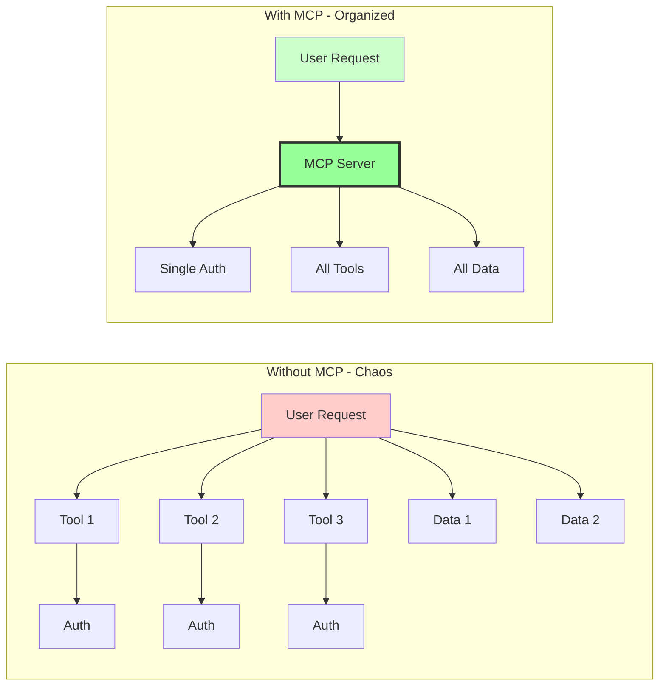
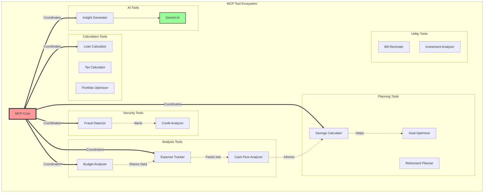
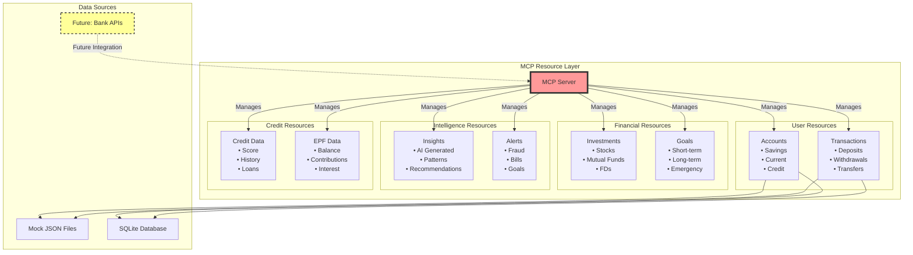
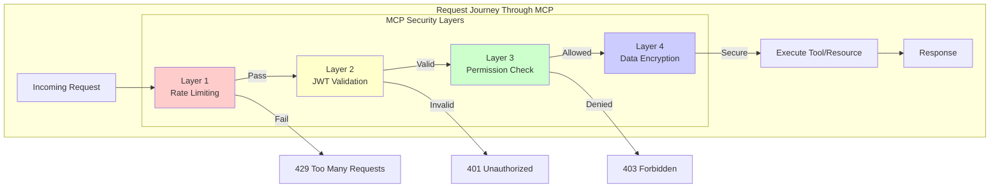
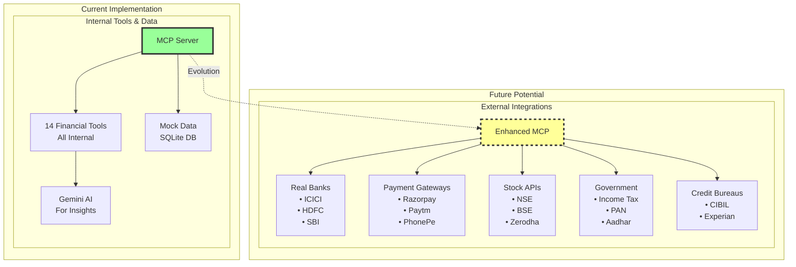
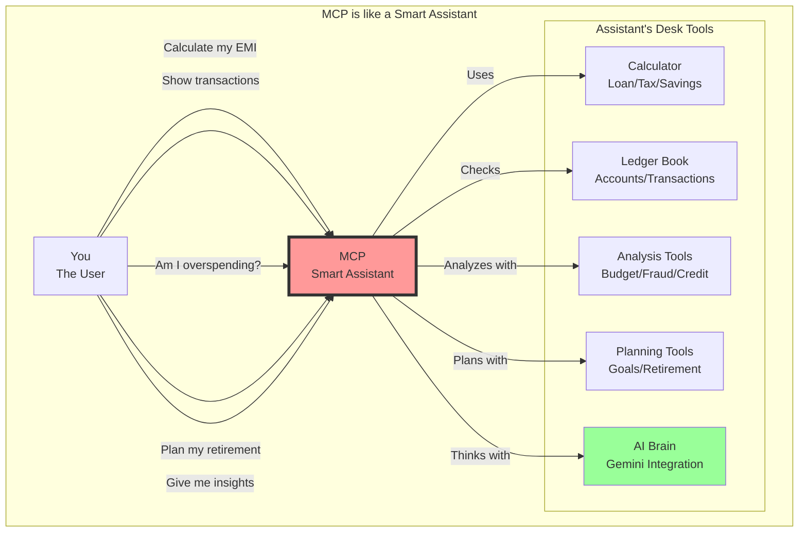

# MCP Architecture - Visual Guide

## 🎯 MCP Coordination Overview

```mermaid
graph TB
    subgraph "External World"
        USER[👤 User]
        GEMINI[🤖 Google Gemini AI]
    end

    subgraph "Entry Layer"
        API[FastAPI<br/>Port 8000]
        WS_API[WebSocket<br/>Port 8000/ws]
    end

    subgraph "MCP Core - The Coordinator"
        MCP_MAIN[🎛️ MCP Protocol Server]

        subgraph "MCP Components"
            SEC[🔐 Security Manager]
            PROTO[📋 Protocol Handler]
            TRANS[📡 Transport Layer]
        end
    end

    subgraph "What MCP Coordinates - Internal Tools"
        subgraph "14 Financial Tools"
            TOOL1[💰 Budget Analyzer]
            TOOL2[📊 Expense Tracker]
            TOOL3[🏦 Savings Calculator]
            TOOL4[🏠 Loan Calculator]
            TOOL5[📈 Investment Analyzer]
            TOOL6[💸 Tax Calculator]
            TOOL7[🏖️ Retirement Planner]
            TOOL8[🎯 Goal Optimizer]
            TOOL9[🚨 Fraud Detector]
            TOOL10[📉 Credit Analyzer]
            TOOL11[📅 Bill Reminder]
            TOOL12[💼 Portfolio Optimizer]
            TOOL13[💵 Cash Flow Analyzer]
            TOOL14[🧠 Insight Generator]
        end
    end

    subgraph "What MCP Manages - Data Resources"
        subgraph "8 Data Resources"
            RES1[🏦 Accounts]
            RES2[💳 Transactions]
            RES3[📈 Investments]
            RES4[🎯 Goals]
            RES5[🔔 Alerts]
            RES6[💡 Insights]
            RES7[📊 Credit Data]
            RES8[💼 EPF Data]
        end
    end

    subgraph "Data Storage"
        DB[(SQLite DB)]
        MOCK[Mock Data]
        CACHE[Redis Cache<br/>Future]
    end

    USER -->|Request| API
    API -->|Protocol| MCP_MAIN
    MCP_MAIN -->|Authenticate| SEC
    MCP_MAIN -->|Validate| PROTO
    MCP_MAIN -->|Route| TRANS

    MCP_MAIN -->|Execute| TOOL1
    MCP_MAIN -->|Execute| TOOL2
    MCP_MAIN -->|Execute| TOOL3
    MCP_MAIN -.->|Coordinates All 14| TOOL14

    MCP_MAIN -->|Access| RES1
    MCP_MAIN -->|Access| RES2
    MCP_MAIN -.->|Manages All 8| RES8

    TOOL14 -->|Uses| GEMINI
    TOOL9 -->|Analyzes| RES2

    RES1 --> DB
    RES2 --> DB
    RES1 --> MOCK
    RES2 --> MOCK

    style MCP_MAIN fill:#ff9999,stroke:#333,stroke-width:4px
    style USER fill:#99ccff,stroke:#333,stroke-width:2px
    style GEMINI fill:#99ff99,stroke:#333,stroke-width:2px
```

## 🔄 Request Flow Through MCP

## 🏗️ MCP as Central Coordinator

## 🎮 MCP Internal Tools Interaction

## 📊 MCP Resource Management

## 🔐 MCP Security Flow

## 🌟 What MCP Currently Does vs Future

## 💡 Simple Analogy

## 🎯 The Key Point

**MCP is NOT connecting to external services. It's coordinating YOUR OWN internal tools and data.**

Think of MCP as:
- 🎛️ **Control Panel** for all your financial tools
- 🔐 **Security Guard** checking every request
- 📋 **Protocol Manager** ensuring standard communication
- 🚦 **Traffic Controller** routing requests to the right tool
- 📊 **Data Coordinator** managing access to your resources

**Current Reality**: MCP manages 14 tools + 8 resources (all internal)
**Future Potential**: MCP could manage external bank APIs, payment gateways, etc.

But right now, it's your **internal financial command center**, not an external service connector!